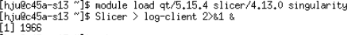

#  Step-by-step Tutorial: use MONAI Label & 3DSlicer on HiperGator
## **Note** ##
1. If you're new to UF Open OnDemand, please refer to [wiki page](https://help.rc.ufl.edu/doc/Open_OnDemand) to learn about how to use it, which will help you understand the following steps.
2. In this tutorial, for the server part, we're using a Singularity container for MONAI Label v0.3.2 pre-built on HiperGator by UF Research Computing. MONAI Label has new release every several months, so if you want to use the latest/a particular version, please use this sample script [build.sh](./build.sh) to build your own MONAI Label Singularity container. 
```
sbatch build.sh
```

See output (sample output [build.sh.job_id.out](./build.sh.job_id.out)):
```
cat build.sh.job_id.out
```   

## **step 1. Explore and download sample applications and datasets**
*Note: you can complete step 1 in an Open OnDemand terminal as well.*
Log in to HiperGator, change `hju` to your username

```
ssh hju@hpg.rc.ufl.edu
```

Go to your home directory 

```
cd ~
```

Download this repository to use the included scripts
```
git clone https://github.com/hw-ju/monai_uf_tutorials.git
```

Make all files in /monai_uf_tutorials executable
```
chmod -R +x /monai_uf_tutorials
```

Go to directory /monailabel which includes scripts for this tutorial
```
cd /monai_uf_tutorials/monailabel
```

List all commands available for MONAI Label server, all available sample applications and all available sample datasets, use sample script [list.sh](./list.sh):
```
sbatch list.sh
```

See output: 
```
cat list.sh.slurm_job_id.out
```

Sample output [list.sh.18594406.out](./list.sh.job_id.out).


Download sample applications and sample datasets to blue/red partition on HiperGator (don't put large dataset in your home directory), use sample script [download.sh](./download.sh).  
```
sbatch download.sh
```

To see output: 
```
cat download.sh.slurm_job_id.out
```

Sample output [download.sh.18587413.out](./download.sh.job_id.out).

## **step 2. Launch a console session on the HWGUI nodes in Open OnDemand**
In your local web browser, go to https://ood.rc.ufl.edu to login to UF Open OnDemand (OOD). *Note: you'll need to use VPN to open the OOD link above if you're off campus.*

Click `Interactive Apps`, then click `Console`:


Fill in the form. 
In field `Cluster partition`, choose `hwgui`. 
In field `Generic Resource Request`, put the number of GPUs you want to use.
Sample filled form:


Once your job starts, set `Compression` and `Image Quality`, and then click `Launch Console`. Sample setting:


## **step 3. Start MONAI Label server and client 3DSlicer**
In the OOD console, load required modules: 
```
module load qt/5.15.4 slicer/4.13.0 singularity
```

Run `3DSlicer` in the background, and direct output to file `log-client` for debugging purpose: 
```
Slicer > log-client 2>&1 & 
```
Sample output:



Once `3DSlicer` opens up, switch back to the console tab. We'll come back after setting up the MONAI Label server.


Edit the config file of your chosen application to e.g., set label names, whether use pre-trained model, choose active learning strategies. The config file is in directory `/apps` where you downloaded the sample app. To open a config file, click `Files` on your OOD page, navigate to it, and then click `edit`:


For example, you can modify `true/false` in the following lines and then click `Save`:
```
use_pretrained_model = strtobool(conf.get("use_pretrained_model", "false"))
self.epistemic_enabled = strtobool(conf.get("epistemic_enabled", "true"))
```


*Note: the name and path of the config file is different for MONAI Label v0.3 and v0.4. E.g., for DeepEdit in radiology apps, it's `/apps/deepedit/main.py` for v0.3 and `/apps/radiology/lib/configs/deepedit.py` for v0.4*


Start a MONAI Label server for your chosen application and dataset:
```
singularity exec --nv -B /blue/vendor-nvidia/hju/monailabel_samples:/workspace /apps/nvidia/containers/monai/monailabel/ monailabel start_server --app /workspace/apps/deepedit --studies /workspace/datasets/Task03_Liver/imagesTr 
```

Once the output shows the server is up, go to 3DSlicer tab, switch to MONAI Label module, and connect with the server by putting the correct compute node name (e.g.,`c45a-s13` in `hju@c45a-s13`) in field `MONAI Label server:`:


## **step 4. Use MONAI Label server and client 3DSlicer to annotate data & train models**
Please refer to [MONAI Label Deep Dive Series](https://www.youtube.com/playlist?list=PLtoSVSQ2XzyD4lc-lAacFBzOdv5Ou-9IA). *Note: the version of MONAI Label and 3DSlicer used in this tutorial is older than the one used in the videos. There're difference in MONAI Label plugin layout in 3DSlicer and MONAI Label sample application scripts.*

Phase 1. Train from scratch (no pre-trained model).
- Use 3DSlicer's internal tool (e.g., segment editor's grow-from-seeds) and/or MONAI Label's scribbles to create annotation.
- Submit label and train.

Phase 2. Train with a pre-trained (not perfect) model.
- Use DeepEdit to interactively improve auto segmentation.
- Submit label and train.

Phase 3. Inference by a perfect model.

*Note: In `3DSlicer`, to use the `Option` section in MONAI Label plugin panel, make sure you go to top menu `Edit` -> `Application`, then click `MONAI Label` on the left panel and check `Developer Mode`:


